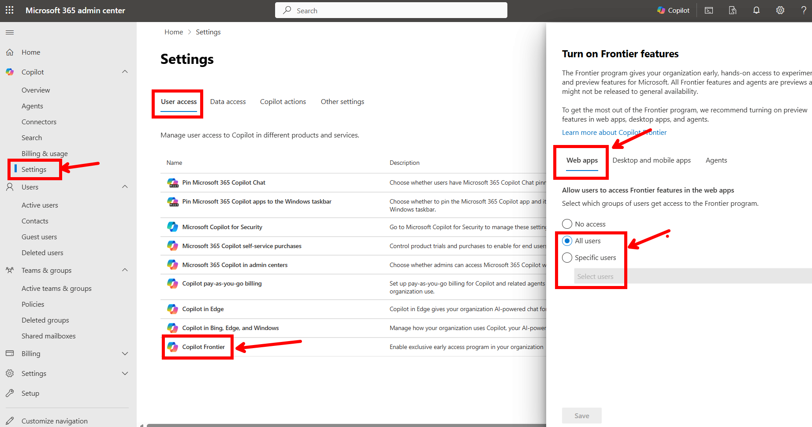
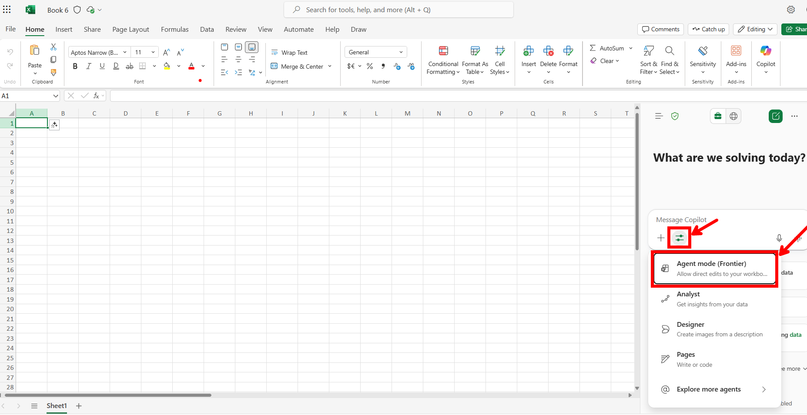

최근 M365 생태계 내 Copilot 관련 여러 새로운 기능들은 특수한 설정을 해주면 GA 되기 전에 먼저 사용해볼 수 있도록 되어있다. M365 웹앱에서는 Frontier 프로그램을 활성화 해줘야하고 데스크탑 앱에서는 베타 채널을 활성화 하면 새로운 기능들을 테스트 느낌으로 먼저 사용해볼 수 있게 활성화 된다. 

그 중 웹앱에 Frontier 프로그램을 활성화 하는 방법은 아래와 같다. 

1. [M365 관리 센터](https://admin.cloud.microsoft/)로 이동
2. [Copilot] - [Settings] - [User access] - [Copilot Frontier] 로 이동
3. 전체 임직원 계정의 Frontier 기능을 활성화 하고자 하면 [Web Apps]의 값을 `All users`로 설정하고, 특정 직원 대상으로만 순차적으로 roll out하고자 한다면 일부 직원의 계정만 `Specific users`에 입력

4. 최대 24시간 정도 대기 후 Frontier 프로그램이 활성화된 사용자의 계정으로 들어가보면 예를 들어 엑셀 같은 경우 [Agent Mode](https://www.microsoft.com/en-us/microsoft-365/blog/2025/09/29/vibe-working-introducing-agent-mode-and-office-agent-in-microsoft-365-copilot/)가 활성화 되어 있는 것을 확인할 수 있음.

